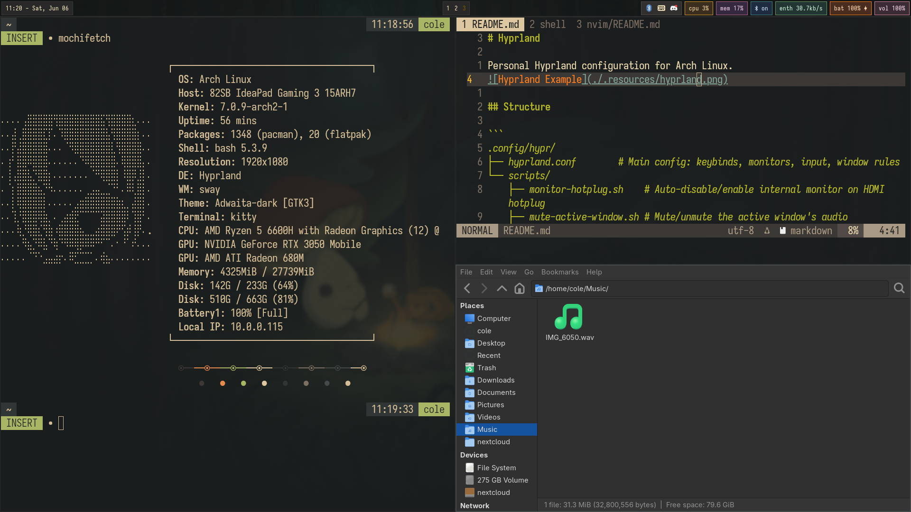
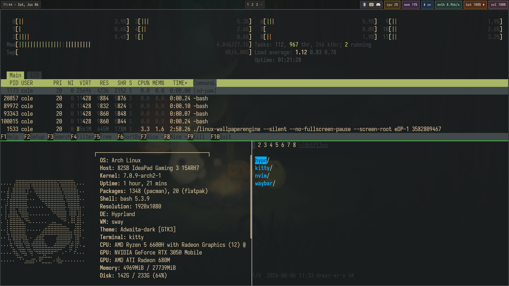
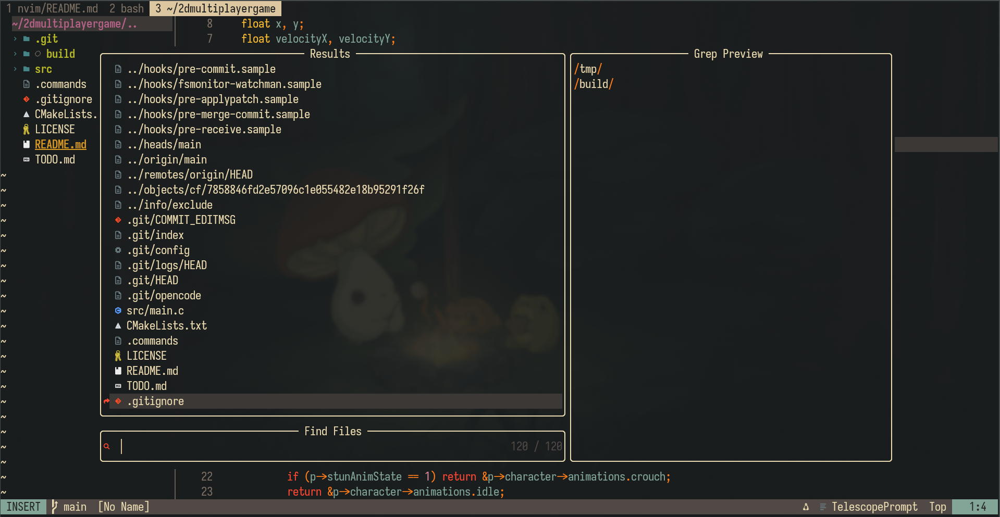
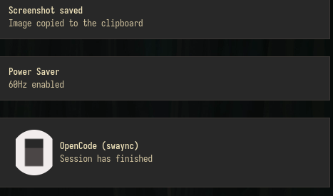
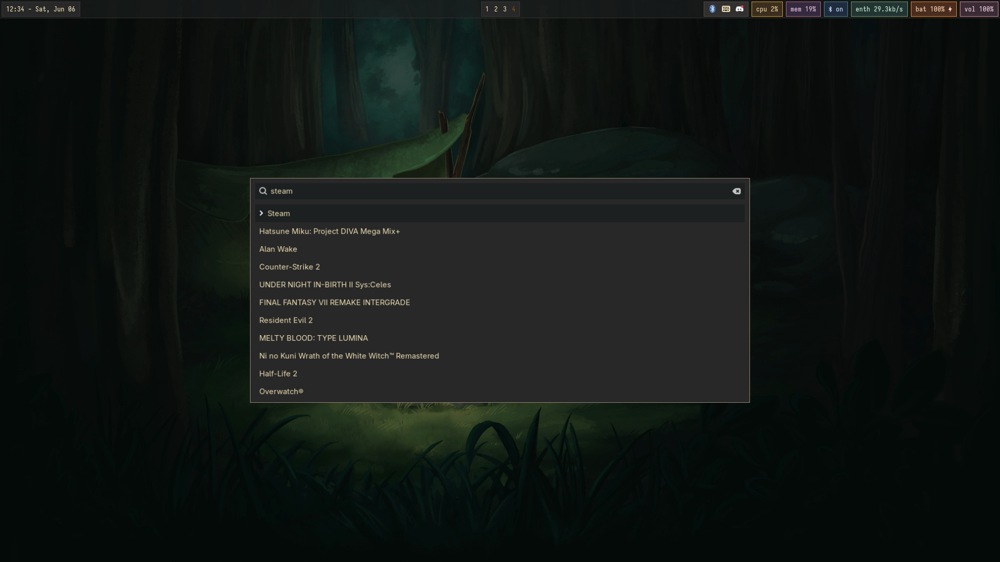
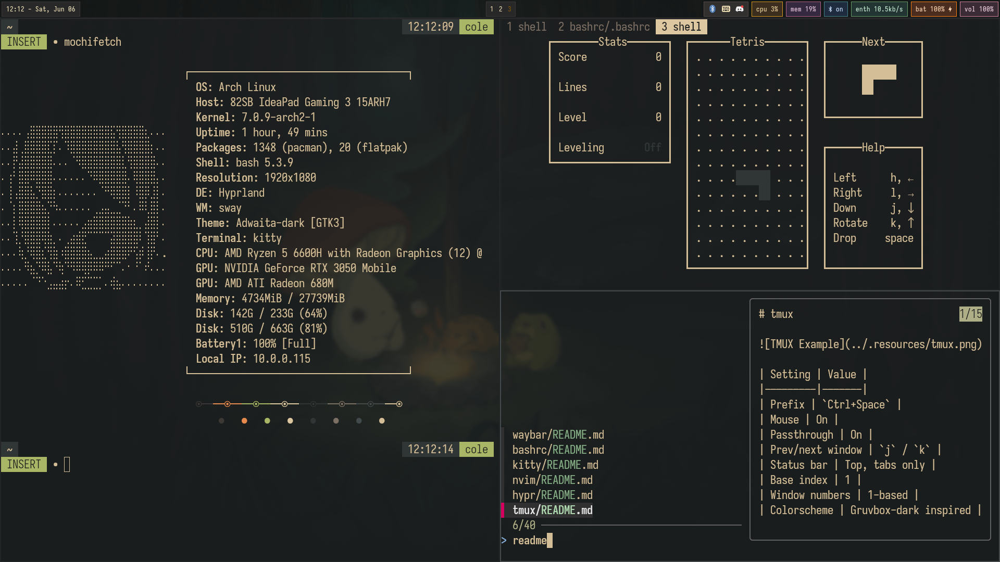
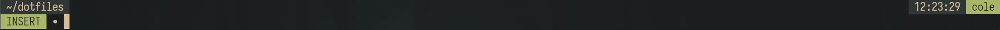

# dotfiles

My personal Arch(btw) Linux desktop configuration with a Gruvbox themed setup built on [Hyprland](https://hyprland.org/).



## Stack

| Component | Choice | Config |
|-----------|--------|--------|
| **Window Manager** | [Hyprland](https://hyprland.org/) | [hypr/](hypr/) |
| **Shell** | Bash + [oh-my-bash](https://github.com/ohmybash/oh-my-bash) | [bashrc/](bashrc/) |
| **Terminal** | [Kitty](https://sw.kovidgoyal.net/kitty/) | [kitty/](kitty/) |
| **Editor** | [Neovim](https://neovim.io/) + [lazy.nvim](https://github.com/folke/lazy.nvim) | [nvim/](nvim/) |
| **Multiplexer** | [Tmux](https://github.com/tmux/tmux) | [tmux/](tmux/) |
| **Status Bar** | [Waybar](https://github.com/Alexays/Waybar) | [waybar/](waybar/) |
| **Notifications** | [SwayNC](https://github.com/ErikReider/SwayNotificationCenter) | [swaync/](swaync/) |
| **Launcher** | [Wofi](https://sr.ht/~scoopta/wofi/) | [wofi/](wofi/) |

## Screenshots

| | | |
|---|---|---|
|  |  |  |
|  |  |  |
|  |  | |

## Install

### Easy

```sh
git clone https://github.com/colechiodo/dotfiles.git ~/dotfiles
cd ~/dotfiles
./install.sh
```

Installs all packages (official + AUR) and stows every component.

---

### Manual

Clone and use [GNU Stow](https://www.gnu.org/software/stow/) to symlink only what you want:

```sh
git clone https://github.com/colechodio/dotfiles.git ~/dotfiles
cd ~/dotfiles
stow --adopt hypr kitty nvim tmux waybar swaync wofi bashrc oh-my-bash
git restore .
```

> [!NOTE]
> This overwrites the files in `dotfiles` directory, but it creates the symlinks from each component's tree into `$HOME` (e.g. `~/.config/hypr/` → `dotfiles/hypr/.config/hypr/`). Afterwards, `git restore .` will bring my custom configs back.

Stow packages individually if you only want specific parts:

```sh
stow --adopt tmux nvim   # just tmux and neovim configs
git restore tmux nvim
```

---

To install packages on their own:

```sh
sudo pacman -S --needed - < pkglist-official.txt
yay -S --needed - < pkglist-aur.txt
```

--- 

> [!IMPORTANT]
> Each component directory has its own `README.md` with full details on keybinds, dependencies, structure, and features.
