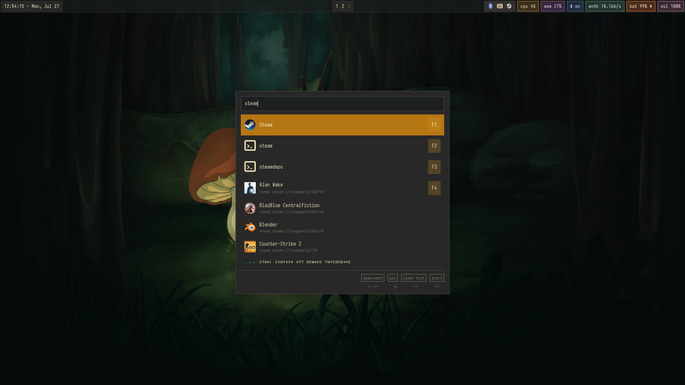

# Walker

Walker configuration — replacement for wofi as the application launcher.

## Features

| Feature | Usage |
|---------|-------|
| Application launcher | Type the app name |
| Calculator | `=2+2` |
| Shell command runner | `>git status` |
| File search | Type any filename |
| Clipboard history | Requires `cliphist` |
| Web search | Type query and pick a provider |

## Keybinds

| Key | Action |
|-----|--------|
| `SUPER + Space` | Open Walker (menu-style) |

## Dependencies

- **walker** — launcher UI
- **elephant** — backend service
- **elephant-desktopapplications** — app search
- **elephant-calc** — calculator
- **elephant-runner** — command execution
- **elephant-files** — file search
- **elephant-websearch** — web search
- **cliphist** (optional) — clipboard history
