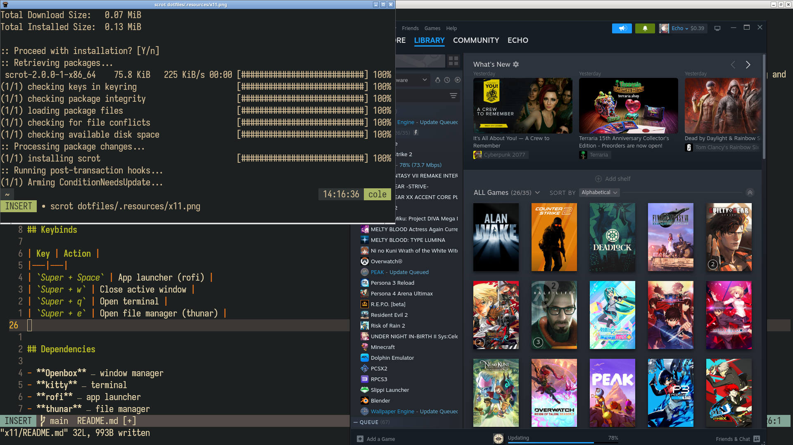

# X11 (Openbox)



> [!NOTE]
> This config is only for X11 sessions running [Openbox](http://openbox.org/). I primarily use Hyprland, but it has issues with things like Sunshine game streaming and OBS Studio window capture. Those work fine under X11. You don't have to install this if you're happy with Wayland.

## Structure

```
.Xmodmap                    # Change capslock to escape
.config/openbox/
├── autostart               # Startup applications and daemons
├── menu.xml                # Right-click desktop menu
└── rc.xml                  # Keybinds, theming, mouse, and desktop settings
```

## Keybinds

| Key | Action |
|---|---|
| `Super + Space` | App launcher (rofi) |
| `Super + w` | Close active window |
| `Super + q` | Open terminal |
| `Super + e` | Open file manager (thunar) |


## Dependencies

- **Openbox** — window manager
- **kitty** — terminal
- **rofi** — app launcher
- **thunar** — file manager
